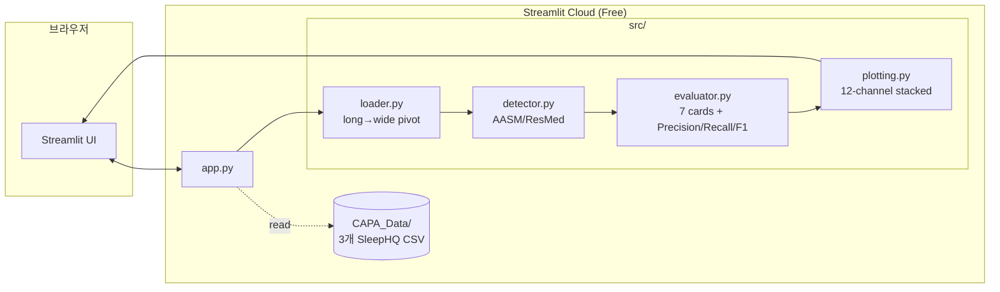

# Soom CPAP Quality Analyzer — Design Spec

- **작성일**: 2026-04-27 (v0.2 갱신)
- **Repo**: https://github.com/hwani627/soom (public)
- **배포**: Streamlit Community Cloud (Free)
- **상태**: v0.2 — SleepHQ 7일 통합 데이터로 전환

---

## 1. 목적

본 프로젝트(PSG급 가정용 CPAP 플랫폼) 시연용 데모 앱. URL 접근만으로:

1. SleepHQ export 12채널 raw 데이터의 시계열 시각화
2. `Breathing` flow에서 직접 검출한 Apnea/Hypopnea를 SleepHQ 이벤트 라벨과 **timestamp 단위 정확 비교** (Precision/Recall/F1)
3. 학술 근거 기반 7카드 + 종합 품질 등급 (XAI)

---

## 2. 범위

### In Scope (v0.2)
- 단일 날짜 세션 분석 (7일 중 선택)
- 12채널 stacked 시계열 차트 + Sleep Stage row
- 표시 채널 사용자 토글
- AHI / Leak / Usage / Pressure / ODI 3% / T90 / Lowest SpO₂ 카드
- timestamp 단위 라벨 일치율
- AASM, ResMed 검출 + 임계값 슬라이더

### Out of Scope (향후)
- 다중 날짜 추세 대시보드
- CA/OA 별도 분류 (FOT 채널 부재)
- HRV-based arousal index
- REM/NREM 분리 AHI (Sleep Stage 매핑 확정 후)

---

## 3. 시스템 아키텍처



---

## 4. 데이터 형식

### 4.1 입력 (CAPA_Data/)
| 파일 | 형식 | 내용 |
|---|---|---|
| `sleephq_rawdata_*.csv` | long: date, timestamp_ms, datetime_utc, data_type, value | 12 채널 (Breathing, Pressure, EPAP, LeakRate, FlowLimit, Snore, SpO2, PulseRate, Movement, RespRate, MinuteVent, TidalVolume) |
| `sleephq_events_AHI_*.csv` | event rows | CA / H / RERA 등 timestamp 정확 라벨 |
| `sleephq_sleep_stages_*.csv` | stage transitions | 인코딩 미확정 (2/3/4/5) |

### 4.2 시간대
모든 timestamp는 **UTC** (`datetime_utc`) 사용. 표시도 UTC.

---

## 5. 모듈 설계

### 5.1 loader.py
```python
list_available_dates(data_root) -> list[str]              # ['2026-04-13', ...]
load_session(data_root, date)   -> dict[str, DataFrame]   # 12채널 + events + sleep_stage
session_duration_hours(session) -> float | None
```
- long format을 data_type별로 분리
- `Timestamp_ET` 컬럼명은 backward-compat용 (실제 값은 UTC)

### 5.2 detector.py
- 변경 없음. `breathing` flow signal에서 envelope/baseline 비율로 Apnea/Hypopnea 후보 검출
- 두 preset: AASM (≥90%/≥30%) / ResMed (<25%/<50%)

### 5.3 evaluator.py
| 함수 | 입력 | 출력 |
|---|---|---|
| `evaluate_quality(session, hours)` | full session | 7 cards + overall (AND-gate) |
| `compare_with_sleephq(detected, events)` | 검출 + SleepHQ events | timestamp overlap 기반 Precision/Recall/F1 |

#### 카드 7종
1. AHI (events 카운트 / hour)
2. Leak (95p < 24 L/min)
3. Usage (>= 4 h)
4. Pressure (95p / 20 < 0.9)
5. ODI 3% (SpO₂ 기반)
6. T90 (SpO₂ < 90% 누적 시간)
7. Lowest SpO₂

### 5.4 plotting.py
- `CHANNEL_META` 13개 (12채널 + sleep_stage), 각각 색상·단위·컬럼 매핑
- `plot_multichannel(session, overlays, channels, height_per_row=180)` — `channels`로 표시할 row 선택 가능
- Sleep Stage는 `line_shape='hv'` (step plot)
- 오버레이 색상: AASM 빨강 / ResMed 보라 / SleepHQ 앰버 (alpha 0.38)

---

## 6. UI 레이아웃

```
┌──────────────────────────────────────────────────────────┐
│ 🌙 Soom CPAP Quality Analyzer                            │
├──────────┬───────────────────────────────────────────────┤
│ 사이드바  │ 메인                                           │
│ 날짜 선택 │ 📋 5 metric (AHI/Leak/Usage/Pressure/Lowest)  │
│ 검출 토글 │ 🏥 7 카드 (4+3 그리드) + 종합 등급             │
│ 임계 슬라 │ 🔍 검출 vs SleepHQ (Precision/Recall/F1)      │
│ 채널 선택 │ 📊 12채널 + sleep_stage stacked chart         │
└──────────┴───────────────────────────────────────────────┘
```

---

## 7. 폴더 구조

```
soom/
├── app.py
├── requirements.txt / runtime.txt
├── .streamlit/config.toml
├── src/
│   ├── loader.py / detector.py / evaluator.py / plotting.py
├── CAPA_Data/
│   ├── sleephq_rawdata_*.csv
│   ├── sleephq_events_AHI_*.csv
│   └── sleephq_sleep_stages_*.csv
├── tests/ (13 tests)
├── docs/specs/
└── README.md
```

---

## 8. 한계 / 향후 작업

| 한계 | 해결 방향 |
|---|---|
| CA/OA 구분 불가 | ResMed SD카드 EDF에서 FOT 채널 직접 추출 (oscar-cpap / pyEDFlib) |
| Sleep Stage 인코딩 미확정 | wearable 출처 확인 후 매핑 테이블 추가 |
| Inspiratory/Expiratory Time 부재 | Breathing flow zero-crossing으로 파생 가능 |
| HRV arousal | PulseRate 시계열에서 추가 구현 |

---

## 9. 학술 근거

- AASM 스코어링: Berry RB et al., *J Clin Sleep Med* 2012; 8(5): 597–619
- ResMed AutoSet White Paper
- FOT: Farré R et al., *Eur Respir J* 1998
- Adherence: CMS Decision Memo 2008 (CAG-00093R2)
- Mask Leak: ResMed Clinical Guideline
- T90: Punjabi NM, *Sleep Med* 2009
- HRV staging: Beattie Z et al., *Physiol Meas* 2017
