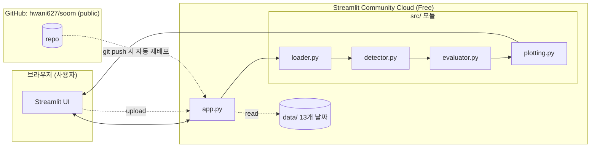
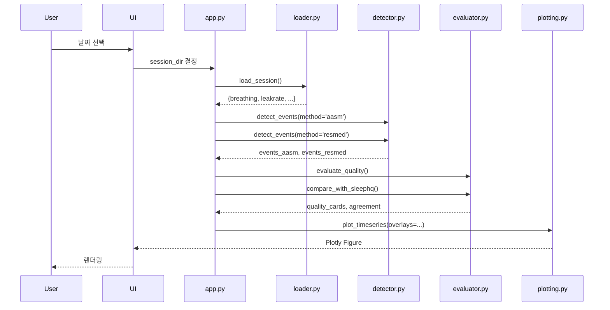

# Soom CPAP Quality Analyzer — Design Spec

- **작성일**: 2026-04-27
- **작성자**: Soom Lead PM (Claude 협업)
- **Repo**: https://github.com/hwani627/soom (public)
- **배포 대상**: Streamlit Community Cloud (Free)
- **상태**: Draft (사용자 검토 대기)

---

## 1. 목적

본 프로젝트(PSG급 가정용 CPAP 플랫폼)의 **시연용 데모 웹 애플리케이션**을 빠르게 구축한다. 시연 대상은 외부 의료진·관계자이며, 데이터 미보유 상태에서도 URL 접근만으로 다음을 확인할 수 있어야 한다:

1. 가정용 CPAP(ResMed AirSense 10 AutoSet) raw CSV 데이터의 시계열 시각화
2. `Breathing.csv` flow 신호에서 직접 검출한 Apnea/Hypopnea 후보 구간을 SleepHQ 라벨과 비교한 일치율
3. 학술 근거에 기반한 CPAP 사용 품질 등급 판정 (XAI 카드)

비전과의 정합성: 본 데모는 본 프로젝트의 비전 "**의료진이 임상적으로 납득할 수 있는 XAI**"의 **proof-of-concept** 단계로 기능한다.

---

## 2. 범위

### 2.1 In Scope (1차 버전)

- 단일 날짜 세션 분석 (CAPA_Data/YYYYMMDD/ 단위)
- 4종 시계열 차트: Pressure, Breathing, LeakRate, FlowLimit
- Apnea/Hypopnea 검출 알고리즘 2종 + 임계값 슬라이더
- SleepHQ 라벨(`AHI_Summary.csv`)과의 카운트 일치율 비교
- 4지표 + 종합 품질 등급 카드 (AHI / Leak / Usage / Pressure)
- 13개 날짜 번들 데모 데이터 + 사용자 CSV 업로드
- Streamlit Community Cloud Free 티어 배포

### 2.2 Out of Scope (향후 확장)

- 다중 날짜 추세 대시보드 (β)
- 2개 날짜 나란히 비교 (γ)
- CA/OA 구분 검출 (FOT 채널 미보유로 원천적 불가)
- SpO₂ 기반 AASM Hypopnea 정확 판정 (외부 데이터 동기화 필요)
- 사용자 인증 / 환자별 DB 저장
- 실시간 스트리밍 분석

---

## 3. 시스템 아키텍처



**원칙**:
- **모듈 분리**: 알고리즘 코드(`detector.py`, `evaluator.py`)는 UI(`app.py`)와 분리하여 향후 PSG 본 플랫폼으로 그대로 이식 가능하게 한다.
- **상태 비저장**: 사용자 업로드 CSV는 메모리에만 존재, 디스크 영구 저장 없음.
- **자동 재배포**: GitHub `main` 브랜치 push 시 Streamlit Cloud가 자동 빌드.

---

## 4. UI 레이아웃

```
┌──────────────────────────────────────────────────────────────────┐
│  🌙 Soom CPAP Quality Analyzer                          [GitHub] │
├────────────────┬─────────────────────────────────────────────────┤
│  사이드바       │  메인 영역                                       │
│  ──────────    │  ──────────────────────────────────────────────  │
│  [데이터 소스] │  📋 세션 요약 카드 (4개 지표)                     │
│   ◉ 번들 데모  │   AHI · Leak95p · Usage · AvgPressure            │
│   ○ 업로드     │                                                  │
│                │  🏥 품질 등급 카드 (4 + 종합)                    │
│  [날짜 선택]   │   AHI ⚠️  / Leak ✅ / Usage ✅ / Pressure ✅     │
│   2026-03-14 ▼ │   각 카드: 측정값 + 임계값 + 출처                │
│                │   종합: AND 게이트 (최하위 등급)                 │
│  [검출 기준]   │                                                  │
│   ☑ AASM       │  📊 시계열 차트 (탭 4개)                          │
│   ☑ ResMed     │   [Breathing] [Pressure] [LeakRate] [FlowLimit] │
│   ☑ SleepHQ    │   - Plotly WebGL (zoom/pan)                      │
│                │   - 색칠 영역 3색: AASM/ResMed/SleepHQ           │
│  [임계값 슬라]│                                                  │
│   Apnea: 25%  │  📈 라벨 일치율 (혼동행렬·요약표)                 │
│   Hypop: 50%  │   AASM vs SleepHQ / ResMed vs SleepHQ            │
│   Min dur: 10s│                                                  │
└────────────────┴─────────────────────────────────────────────────┘
```

---

## 5. 모듈 설계

### 5.1 `src/loader.py`

```python
def load_session(session_dir: Path) -> dict[str, pd.DataFrame]:
    """7종 CSV(또는 6종)를 읽어 dict로 반환. 결측 파일 허용 (Statistics 누락 등)."""
    # returns {'ahi_summary': df, 'statistics': df, 'pressure': df,
    #          'breathing': df, 'flowlimit': df, 'leakrate': df, 'snore': df}
```

- 타임존 일관 처리 (모든 timestamp는 ET → UTC 변환 옵션)
- 결측 파일 (e.g. Statistics 미존재일) graceful 처리

### 5.2 `src/detector.py`

```python
def detect_events(
    breathing: pd.DataFrame,
    method: Literal['aasm', 'resmed'],
    apnea_thr: float,    # default 0.25 (resmed) / 0.10 (aasm)
    hypop_thr: float,    # default 0.50 (resmed) / 0.70 (aasm)
    min_dur_sec: int = 10,
    baseline_window_sec: int = 100,
) -> pd.DataFrame:
    """flow envelope vs baseline 비율로 Apnea/Hypopnea 후보 검출.
    returns: [start_ts, end_ts, type, duration_sec, ratio_min]"""
```

**알고리즘 단계**:
1. 2초 rolling RMS로 flow envelope 계산
2. 100초 rolling 60th-percentile로 baseline 계산 (ResMed 방식)
   - AASM 방식: 직전 2분 mean
3. ratio = envelope / baseline
4. ratio < apnea_thr 인 구간이 ≥10초 → Apnea
5. apnea_thr ≤ ratio < hypop_thr 인 구간이 ≥10초 → Hypopnea

**한계 명시 (UI 표시)**:
- CA(Clear Airway) vs OA(Obstructive) 구분 불가 (FOT 채널 export 안 됨)
- AASM Hypopnea의 SpO₂ 3% desat 조건 검증 불가 (SpO₂ 미보유)

### 5.3 `src/evaluator.py`

```python
def evaluate_quality(
    session: dict, detected_events: dict[str, pd.DataFrame]
) -> dict:
    """returns: {
        'ahi':      {'value': float, 'grade': '✅|⚠️|❌', 'threshold': str, 'source': str},
        'leak':     {...},
        'usage':    {...},
        'pressure': {...},
        'overall':  {'grade': '✅|⚠️|❌', 'reason': str}
    }"""
```

| 카드 | 판정 기준 | 출처 |
|---|---|---|
| AHI | <5 ✅ / 5–15 ⚠️ / ≥15 ❌ | AASM 2012 (Berry et al.) |
| Leak | LeakRate 95p < 24 L/min ✅ else ❌ | ResMed Clinical Guideline |
| Usage | Breathing 시작~끝 ≥ 4h ✅ else ❌ | CMS Medicare 2008 |
| Pressure | Pressure 95p / max < 0.9 ✅ else ⚠️ | ResMed AutoSet manual |
| 종합 | AND 게이트 (최하위 등급) | — |

```python
def compare_with_sleephq(
    detected_events: pd.DataFrame, ahi_summary: pd.DataFrame, session_hours: float
) -> dict:
    """카운트 단위 일치율 (timestamp 매칭은 1차 범위 외).
    returns: {'detected_count': int, 'sleephq_count': int, 'agreement_ratio': float}"""
```

### 5.4 `src/plotting.py`

```python
def plot_timeseries(
    df: pd.DataFrame, channel: str,
    overlays: dict[str, pd.DataFrame]  # {'aasm': events, 'resmed': events, 'sleephq': events}
) -> plotly.graph_objects.Figure:
    """Plotly scattergl + add_vrect로 색칠 영역 오버레이."""
```

- 4.3만 행 Breathing 처리 위해 **`scattergl` (WebGL)** 사용
- 색칠 색상: AASM 빨강 / ResMed 파랑 / SleepHQ 초록 (alpha 0.2)

---

## 6. 데이터 흐름



---

## 7. 폴더 구조

```
soom/                        # = hwani627/soom GitHub repo
├── app.py                   # Streamlit 진입점
├── requirements.txt
├── runtime.txt              # python-3.11
├── .streamlit/
│   └── config.toml          # 테마, 업로드 한도
├── src/
│   ├── __init__.py
│   ├── loader.py
│   ├── detector.py
│   ├── evaluator.py
│   └── plotting.py
├── CAPA_Data/               # 13 날짜 익명 데모 데이터 (data/ 대신 기존 이름 유지)
│   ├── 20260306/
│   ├── ...
│   └── 20260402/
├── tests/
│   ├── test_loader.py
│   ├── test_detector.py
│   └── test_evaluator.py
├── docs/
│   └── specs/2026-04-27-soom-cpap-analyzer-design.md
├── README.md
├── LICENSE                  # MIT (선택)
└── .gitignore
```

---

## 8. 에러 처리 / 엣지 케이스

| 케이스 | 처리 |
|---|---|
| Statistics.csv 누락일 (4개 날짜) | warning 표시, 해당 카드 "측정 불가" |
| 사용자 업로드 형식 불일치 | st.error로 명확한 메시지 + 기대 형식 안내 |
| Breathing baseline 100초 미만 데이터 | 에러 대신 데이터 사용 시간 정보만 표시 |
| Plotly 렌더링 실패 | st.exception()로 trace 표시 |
| 검출 결과 0건 | "이벤트 미검출 — 임계값 조정해 보세요" 안내 |

---

## 9. 테스트 전략

- **단위 테스트 (pytest)**:
  - `test_loader.py`: 정상/누락/깨진 CSV 처리
  - `test_detector.py`: 합성 신호로 Apnea 1회 주입 → 정확히 1건 검출되는지
  - `test_evaluator.py`: 알려진 AHI/Leak 값으로 등급 판정 정확성
- **통합 시연 검증**: 13개 날짜 모두 로딩·차트 렌더링 확인
- **CI**: 1차 버전은 수동 (GitHub Actions는 향후 추가)

---

## 10. 배포 절차

### 10.1 사전 조건
- GitHub repo `hwani627/soom` (public, 사용자 전환 완료 ✅)
- 로컬 디렉토리: `/Users/yhchoi/Desktop/Claude_Contents/soom/soom_Project/` → git init 후 remote 연결

### 10.2 Streamlit Cloud 배포 (사용자 직접 1회 실행)

1. https://share.streamlit.io 접속 → **GitHub 계정으로 로그인**
2. 권한 부여: `hwani627/soom` repo 액세스 허용
3. **"New app"** 클릭, 다음 입력:
   - Repository: `hwani627/soom`
   - Branch: `main`
   - Main file path: `app.py`
   - App URL (선택): `soom-cpap` 등
4. **"Deploy!"** 클릭 → ~2~3분 후 배포 완료
5. URL 예: `https://soom-cpap.streamlit.app`
6. 이후 GitHub push 시 자동 재배포

### 10.3 후속 운영
- README.md에 배포 URL · 시연 영상 GIF · 알고리즘 출처 명시
- 본 프로젝트(PSG급 플랫폼) `프로젝트개요/`의 readme.md에 본 데모 링크 추가

---

## 11. 학술 근거 출처

| 항목 | 출처 |
|---|---|
| AASM 스코어링 룰 | Berry RB et al. *J Clin Sleep Med* 2012; 8(5): 597–619 |
| ResMed AutoSet 알고리즘 | ResMed AirSense 10 AutoSet Algorithm White Paper |
| FOT (Forced Oscillation Technique) | Farré R et al. *Eur Respir J* 1998 |
| Medicare CPAP Adherence | CMS Decision Memo 2008 (CAG-00093R2) |
| Mask Leak threshold | ResMed Clinical Guideline |

---

## 12. 향후 확장 로드맵

- v1.1: 다중 날짜 추세 대시보드 (β)
- v1.2: 2개 날짜 비교 모드 (γ)
- v1.3: SpO₂ / Pulse Rate 외부 동기화 (HealthKit / Garmin API)
- v2.0: AI 모델 통합 (CA/OA 추정, Hypopnea 분류) — 별도 백엔드(Hugging Face Spaces) 추가
- v2.1: 본 PSG급 플랫폼 본 코드로 이식
